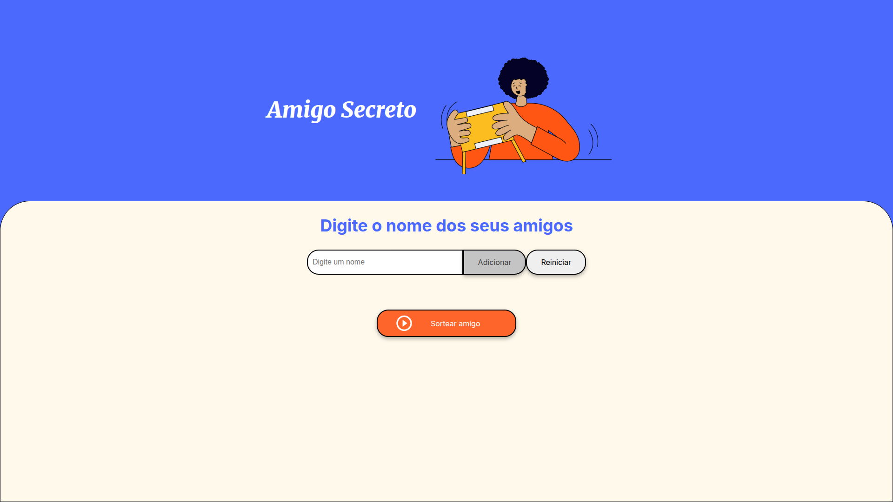

# 🎁 Sorteador de Amigo Secreto

Uma aplicação simples e divertida onde você adiciona nomes de amigos e o sistema sorteia aleatoriamente um deles.

  

---

## 🚀 Demonstração

- Jogue agora mesmo online:  
👉 [Link do Projeto no Vercel](https://desafio-amigo-secreto-one-three.vercel.app/)
---

## 📌 Funcionalidades

- Adicionar nomes à lista
- Reiniciar lista de nomes
- Sortear aleatoriamente um dos amigos
- Interface simples, responsiva e divertida

---

## 🛠 Tecnologias utilizadas

  
  
  
  

